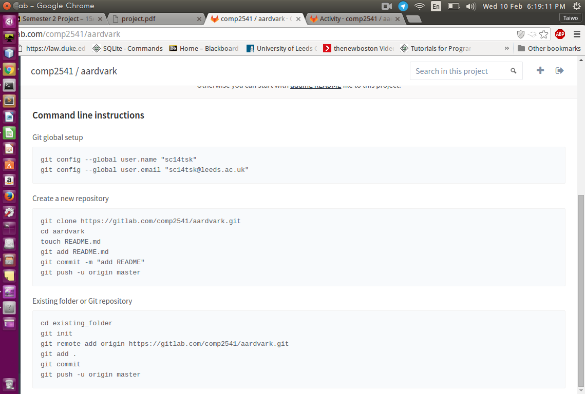

# Restaurant Booking And Billing System (Team Aardvark)

The project involves the development of a restaurant table booking and billing system. So that would entail designing three main aspects: client, server & database.

## MESSAGE TO ALL AARDVARK MEMBERS (THINGS TO DO):

Setup your git repository on your local machine by using the commands below,

`git config --global user.name "username"`
`git config --global user.email "username@leeds.ac.uk"`

Use: `git clone https://gitlab.com/comp2541/aardvark.git` from the terminal to get update.

See screenshot

# Contacts
* [Danilo Andrade](https://gitlab.com/u/ed11d2a)
* [Jhighar Mistry](https://gitlab.com/u/sc14jm)
* [Othman Ali Khan](https://gitlab.com/u/sc14omsa)
* [Pam Iwalewa](https://gitlab.com/u/sc13pi)
* [Taiwo Kareem](https://gitlab.com/u/sc14tsk)

> Repository located at [Gitlab](https://gitlab.com/comp2541/aardvark)

**Edit as necessary. Skeleton version**
