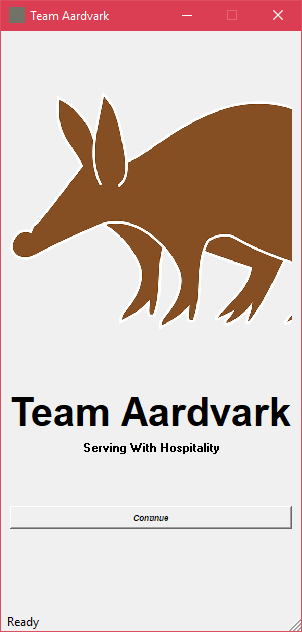
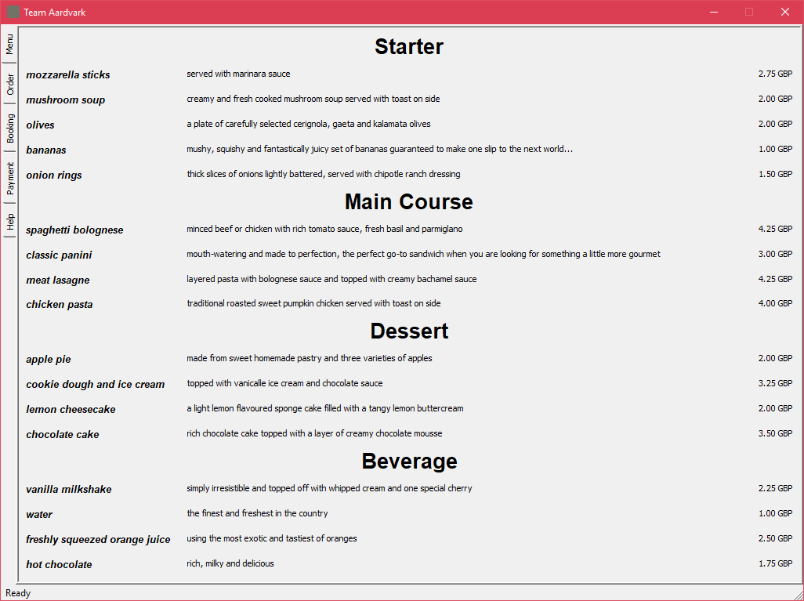
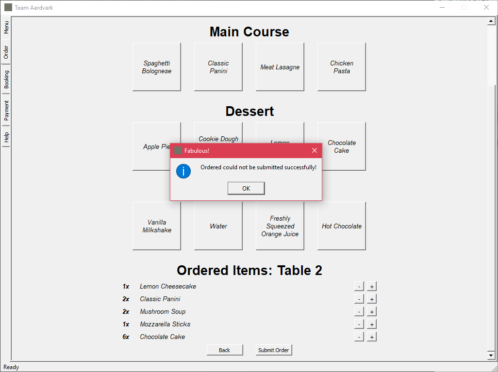
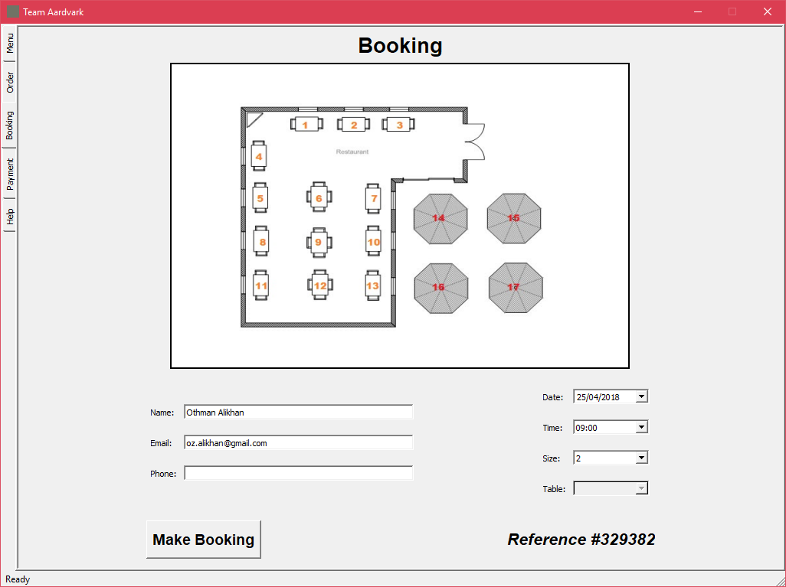

## Team Aardvark--Restaurant Booking And Billing System

This project represents a client-server desktop application for restaurant
management. The front-end is a PyQt desktop application while the backend
runs a desktop Django server.

Team Aardvark was our group name for the 2nd year project at University.
In addition to the final product (see below), the intention of the project was
to explore software development methodologies. In particular, we explored
Scrum (see Wiki).

## Screenshot: Splash Menu

  

## Screenshot: Restaurant Menu

## Screenshot: Order Menu

## Screenshot: Booking Menu

## Key Features

* Easily modifiable restaurant menu that is fetched from the Django server.
* Booking of available slots through the client application.
* Implementation of a restaurant menu cart for each table.
* Handling of customer payments and storing transaction history (incomplete).

## Requirements

* Python 3+
  * Django (2.0.2)
  * Sphinx (1.6.3)
  * model-mommy (1.5.1)
  * requests (2.18.4)
  * PyQt5 (5.10.1)

## How to Run

### Simple Method

Create and install the needed environment (virtual environment and required
packages) by simply running the following script:

    install.bat

Now launch the server then connect to it via the client by running the
following scripts:

    runServer.bat
    runClient.bat

### Fight Me Method

Otherwise, if you prefer an unnecessary challenge, you can manually install
the dependencies thereafter invoking the server and client via `setup.py`.
The full list of commands available are mentioned below:

    python setup.py runClient
    python setup.py runServer
    python setup.py runTest
    python setup.py runManualTest
    python setup.py runClean
    python setup.py generateDoc
    python setup.py runDoc

For further built-in **bonus** commands by default, seek help via:

    python setup.py --help-commands

## Authors (Team Aardvark)

|                       Name                        |         Email        |
| ------------------------------------------------- |:--------------------:|
| [Othman Ali Khan](https://gitlab.com/u/sc14omsa)  | sc14omsa@leeds.ac.uk |
| [Taiwo Kareem](https://gitlab.com/u/sc14tsk)      | sc14tsk@leeds.ac.uk  |
| [Jhighar Mistry](https://gitlab.com/u/sc14jm)     | sc14jm@leeds.ac.uk   |
| [Danilo Andrade](https://gitlab.com/u/ed11d2a)    | ed11d2a@leeds.ac.uk  |
| [Pam Iwalewa](https://gitlab.com/u/sc13pi)        | sc13pi@leeds.ac.uk   |

## License

This code is distributed under the MIT license. For further information, see the LICENSE file.
